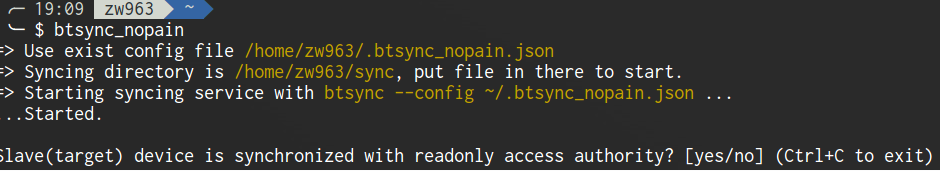
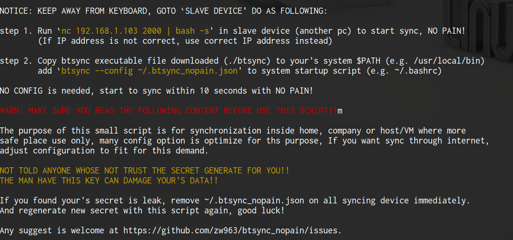

This small script is for quickly start synchronize data with [BitTorrent Sync](https://getsync.com/) between your device.
should be start to work less than 10 seconds with internet connection(for download btsync binary only)

## Philosophy
initialize a worked btsync config with minimum effort, make synchronize between two device
start to work immediately in config mode with NO PAIN.

It convenient for sync data between home/compary localnet pc, between host and virtual machine
and autobackup things, after change some config, can worked through internet. be careful to
understood config completely before do this.

About BitTorrent Sync Documents, Please refer to [Running Sync in configuration mode](http://help.getsync.com/hc/en-us/articles/204762689-Running-Sync-in-configuration-mode#overview)

## Requirement
1. netcat(nc) is required for transmit script from one device to another device.
2. `wget` is required in linux, `curl` is required in BSD (should be there in most UNIX like system)
3. Need BitTorrent Sync support this platform.

## Getting Started
Make your two device sync immediately only need two step!

Step one, down script to local, Open your's terminal:
Linux:
```sh
  $ wget https://raw.githubusercontent.com/zw963/btsync_no_pain/master/btsync_no_pain
```

BSD, if not wget is installed.
```sh
  $ curl https://raw.githubusercontent.com/zw963/btsync_no_pain/master/btsync_no_pain > btsync_no_pain
```
Run this script with bash.
```sh
  $ bash btsync_no_pain
```
In this step, this script will try download btsync to current device (if not exist), and
start btsync with a predefined config, and then ask you whether synchronized to another
device with **readonly** access authority.



Press yes for readonly sync, or vice versa.

will See following WARN message for you:



Step Two, is operate in another device(Slave device), Please read WARN carefully,
and open your's **slave device** terminal, input:

$ nc *MASTER_DEVICE_IP_ADDRESS* 2000

it Done! your's two device `~/sync` folder should be syncing now, Just have a try.

Basically, the last step do following things:

1. Generate **slave device** btsync predefined config according to **master device** config.
2. transmit this script to slave deivce, and run it with bash in slave device.
3. do the same things with master deivce (e.g. download, start)

## Support
Should worked with Linux/BSD/OSX/Andorid.

OSX need install btsync with official dmg package first, current not test.

Andorid Support is irrelevant of offical btsync apk package, it need adbtools to install
[busybox](https://www.busybox.net/downloads/binaries/busybox-armv5l) (with wget, uname command), current not tested.

## Limitations
* Windows is current not supported.
* BitTorrent Sync Web UI is closed.
* btsync is not open source, maybe use [syncthing](https://github.com/syncthing/syncthing) instead.

## History
  See [CHANGELOG](https://github.com/zw963/btsync_no_pain/blob/master/CHANGELOG) for details.
  
## Contributing
  * [Bug reports](https://github.com/zw963/btsync_no_pain/issues)
  * [Source](https://github.com/zw963/btsync_no_pain)
  * Patches:
    * Fork on Github.
    * Create your feature branch: \`git checkout -b my-new-feature\`.
    * Commit your changes: \`git commit -am 'Add some feature'\`.
    * Push to the branch: \`git push origin my-new-feature\`.
    * Send a pull request :D.
